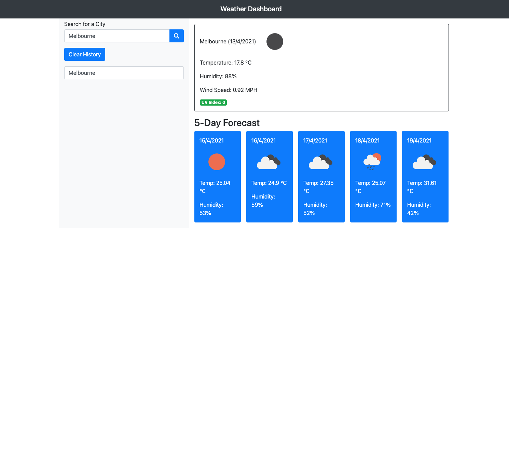

# Homework-6: Weather Dashboard

## Overview:

The purpose of this assignment was to create a weather dashboard app utilising Javascript and bootstrap frameworks as well as the server side API OpenWeather (https://openweathermap.org)

## Implementation Details

1. Development of HTML and CSS files and incorporating Bootstrap styling to resemble the mock up previously provided.

2. Implementation of Javascript file to propertly display the current weather for an specific city as well as the weather conditions for the next five days.

3. Generated comments along the Javascript file for clarity within the code.

## Screenshot

## Deployed Application

Please click on the following link for application:

https://luisbonilla89.github.io/Weather-Dashboard/

# Licence

MIT
